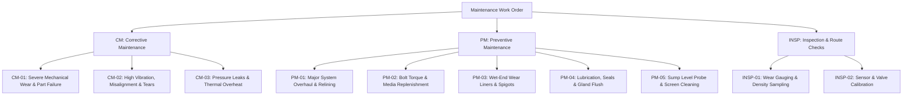

# Maintenance Work Order Codes & Failure Cause Reference Guide

This reference guide explains every maintenance work order type code (`CM-*`, `PM-*`, `INSP-*`) present in [`data/maintenance_history.csv`](file:///home/zakaria/Documents/ProjetPFA/digital-twin-dashboard/data/maintenance_history.csv).

---

## 🛠️ 1. Corrective Maintenance (CM Series — Unplanned & Failure-Driven)

Corrective maintenance work orders are triggered in response to component degradation, operational alarms, or component failure.

| Work Order Code | Category Name | Underlying Cause / Meaning | Operational Triggers | Real-World Examples from Plant |
|---|---|---|---|---|
| **`CM-01`** | **Severe Mechanical Wear & Breakdown** | Direct slurry erosion, mechanical fatigue, or weld cracking requiring immediate part replacement. | Wall thickness drop below threshold, slurry leakage, or abnormal acoustic noise spikes. | • Slurry Pump `SP_001` throatbush & rubber impeller liner replacement due to phosphate slurry erosion. • Ball Mill `BM_001` gearbox acoustic noise spike (flushed gear oil & drain plug). • Pump Box `PB_001` cracked discharge flange weld repair. |
| **`CM-02`** | **High Vibration, Misalignment & Structural Tears** | Rotational imbalance, belt misalignments, or flexible elastomer tears under heavy dynamic load. | Vibration sensor alarms ($>7.0\text{ mm/s}$ RMS), tear inspection, or slurry spraying. | • Slurry Pump `SP_001` drive-end bearing vibration spike ($7.2\text{ mm/s}$) requiring pulley rebalancing. • Hydrocyclone `CY_001_B` underflow splash skirt tear causing slurry spray. • Hydrocyclone `CY_001_C` intermittent apex choking / roping event. |
| **`CM-03`** | **Pressure Leakage & Thermal Overheat Alerts** | Gasket seal blowout under high pressure or bearing lubricant thermal breakdown under heavy mill loads. | Pressure drop across line, slurry leakage at flanges, or bearing temp alert ($>68^\circ\text{C}$). | • Slurry Pump `SP_001` high-pressure suction flange gasket blow-out. • Ball Mill `BM_001` trunnion bearing temperature alert ($68^\circ\text{C}$) requiring lube oil filter cleaning. |

---

## 📅 2. Preventive Maintenance (PM Series — Planned & Time-Based)

Preventive maintenance work orders are scheduled at fixed calendar intervals or operating-hour thresholds to prevent failures.

| Work Order Code | Category Name | Maintenance Scope & Purpose | Recurrence Interval | Real-World Examples from Plant |
|---|---|---|---|---|
| **`PM-01`** | **Major System Overhaul & Relining** | Full structural rebuild, complete interior shell relining, and major bearing/seal replacement. | Annual / Bi-annual (8,000 to 12,000 hrs) | • Slurry Pump `SP_001` annual overhaul (drive shaft sleeve & SKF heavy-duty roller bearings). • Ball Mill `BM_001` shell relining (72-piece high-chrome cast steel set & trunnion seals). • Pump Box `PB_001` basin de-sludging & elastomer lining patch repair. |
| **`PM-02`** | **Structural Torque & Grinding Media Top-Up** | Bolt torque verification under heavy rotational stress and ball mill grinding media replenishment. | Bi-monthly (60 days) | • Ball Mill `BM_001` liner bolt torque check and addition of 15 to 20 tons of forged 80mm/100mm steel grinding balls. |
| **`PM-03`** | **Wet-End Wear Liner & Spigot Replacement** | Scheduled replacement of high-wear sacrificial polyurethane and ceramic liners. | Monthly to Quarterly (30--90 days) | • Hydrocyclones `CY_001_A/B/C` polyurethane apex spigot & ceramic lower cone insert replacement. • Slurry Pump `SP_001` casing liner clearance adjustment to $0.5\text{ mm}$. |
| **`PM-04`** | **Lubrication, Seals & Gland Servicing** | Flushing gland seal water channels, inspecting spray nozzles, and replacing seal packing rings. | Quarterly (90 days) | • Slurry Pump `SP_001` gland seal packing ring set & mechanical seal flush. • Ball Mill `BM_001` girth gear spray lubrication nozzle & solenoid valve inspection. |
| **`PM-05`** | **Sump Instrumentation & Screen Cleaning** | Cleaning level sensors, clearing trash screens, and inspecting anti-turbulent baffles. | Monthly / Quarterly | • Pump Box `PB_001` ultrasonic level probe sensor cleaning and trash screen clearing. |

---

## 🔍 3. Inspection & Diagnostic Maintenance (INSP Series — Non-Intrusive)

Inspection work orders involve non-destructive testing, calibration, and route checks.

| Work Order Code | Category Name | Maintenance Scope & Purpose | Recurrence Interval | Real-World Examples from Plant |
|---|---|---|---|---|
| **`INSP-01`** | **Dimensional Gauge & Density Sampling** | Measuring physical wear dimensions (e.g. spigot aperture diameter) and taking density samples. | Bi-monthly / Routine | • Hydrocyclone `CY_001_A/B` spigot aperture gauge measurement ($48\text{ mm}$) and wall thickness ultrasonic check. |
| **`INSP-02`** | **Instrument & Transmitter Calibration** | Calibrating pressure sensors, differential pressure transmitters, and testing isolation valves. | Quarterly / Semi-annual | • Hydrocyclone `CY_001_C` feed pressure sensor calibration & isolation valve testing. |

---

## 📊 Summary Mapping Table

